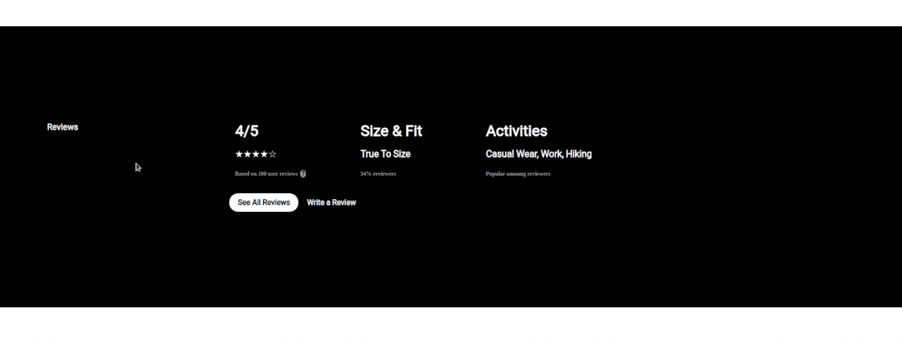
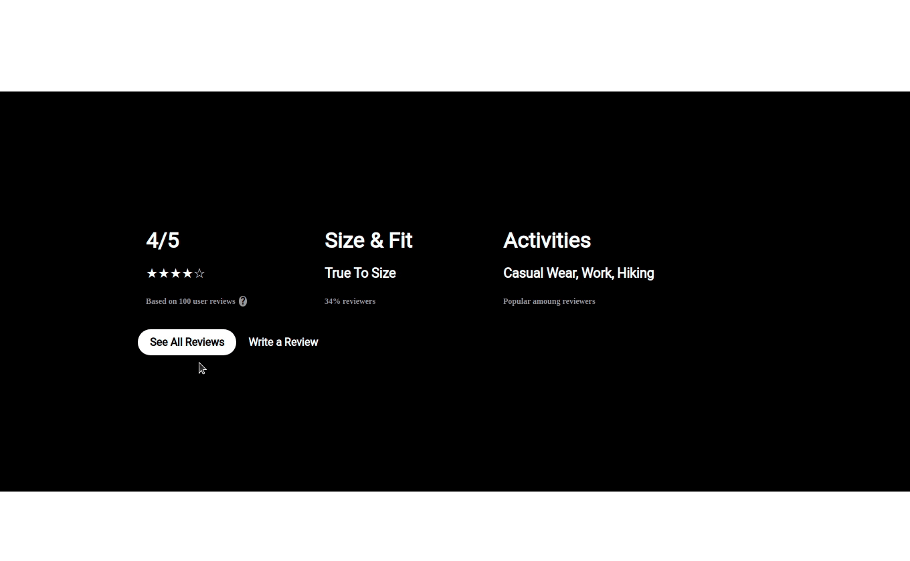
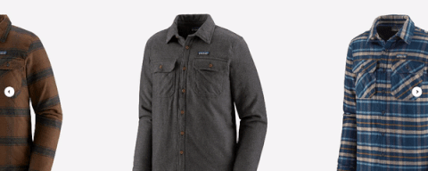
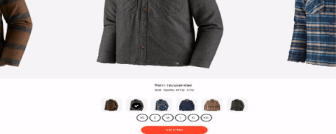
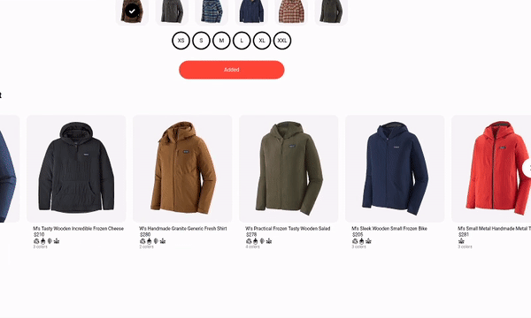

# Fjords Project * Legacy *
#### Developed by Team libraFX, Designs by Samuel Bjorklund

## Description
*(instances have been terminated upon project completion, for demo or product walk-through please contact organization team leader Samuel Bjorklund at https://github.com/Bjorklundsamm/)*

Collaborative project containing collection of single page web applications designed congruantly for displaying and managing product detail page of an outdoors/camping equipment retailer. All components are designed solely as front-end development projects and have not been scaled or optimized by Team libraFX. All back-end features have been developed around use of procedurally generated data stored in MongoDB. Project released in association with Galvanize, SEI.
For more detailed information on each product including requirements, instructions, and implementation please see the individual README files per component.

## Featured Components
Component | Developer | Github
--------- | --------- | ----------
End-user feedback management | Samuel Bjorklund | https://github.com/Bjorklundsamm
Product Details | Zachary Cush | https://github.com/mokezonline
Similar Products | Alex Klyuev | https://github.com/aklu96

## **End-user feedback mangement** _(Samuel Bjorklund)_

Modal/Overlay system designed to allow users to quickly take in a high level overview of a product, access reviews of other users, and offer personalized feedback. Created using React, Express, Node, Styled Components, and Material UI. Compiled using Webpack and Babel following the AirBnB style preset for ESLint. For more details regarding libraries and other tools used during development please see direct repository!(https://github.com/Bjorklundsamm/FDBK-Management-va1.12)
### **Smooth, lightening-fast loadtimes. Live data representation and stat tracking.**
--------

**Organized and accessible interface** | **Intuitive and responsive design**
------ | -----
  | 

## **Product Details** _(Zachary Cush)_
Interactive image carousel tasked with displaying all product variations, tracking inventory and assisting end-users with the check-out process. Reference images sourced through Patagonia's select of Men's winter jackets. Front end developed using React, CSS Grid, Node and Express. Tested via Enzyme, ESLint, Jest, FakerJS and Express. For more details regarding libraries and other tools used during development please see direct repository!(https://github.com/LibraFX/style-carousel)

**Seemless carousel integration** | **Interactive page controls**
---- | ----
 | 

## **Similar Products** _(Alex Klyuev)_
Highly interactive image carousel design to determine, highlight and feature similar products as designated by client. Optimized for sorting and handling large amounts of instanced data at minimum impact to load times. Developed using React, Express, Concurrently, and Node.js. For more details regarding libraries and other tools used during development please see direct repository!(https://github.com/LibraFX/similar-products)

**High functionality, low error rate**

Thank you for your interest in our product!
All projects feature are available, open source, at our organization's page(https://github.com/LibraFX).
If your interested in discussing the product featured above or any potential future projects we may be involved in please don't hesitate to reach out to us at the links feature above.

#### Samuel Bjorklund
> libraFX team-lead

> Full Stack Engineer
